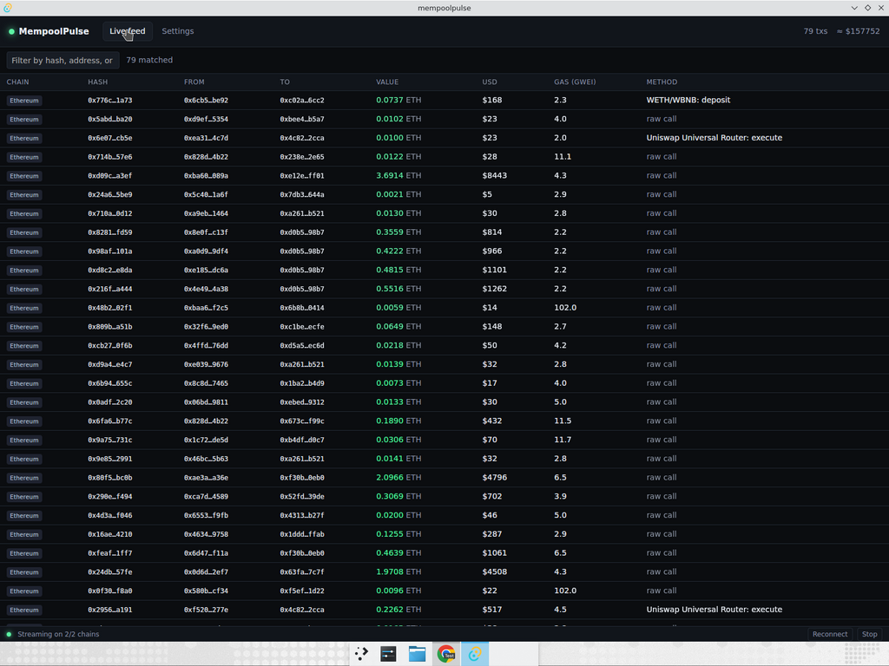
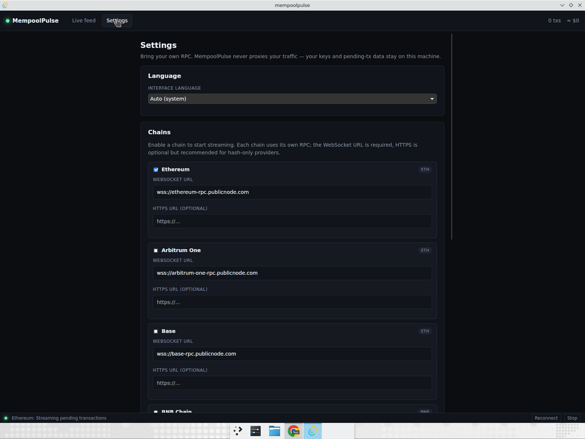
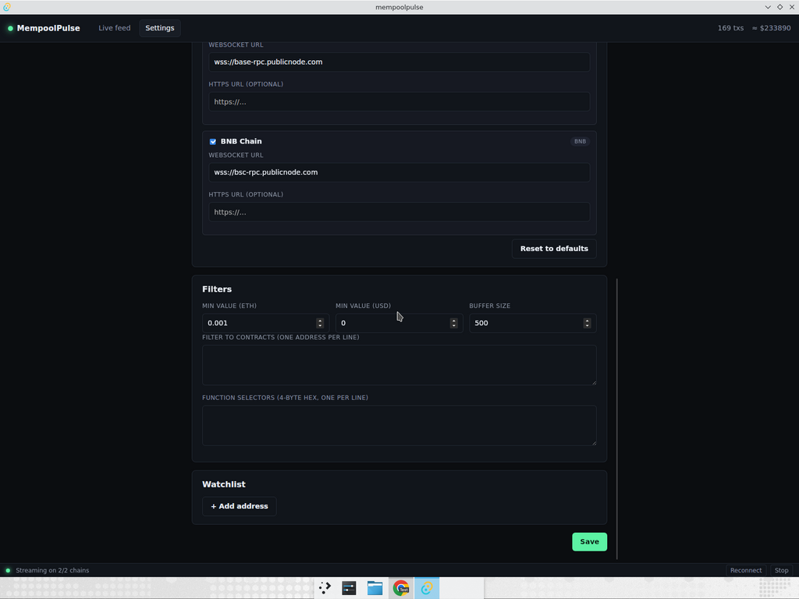
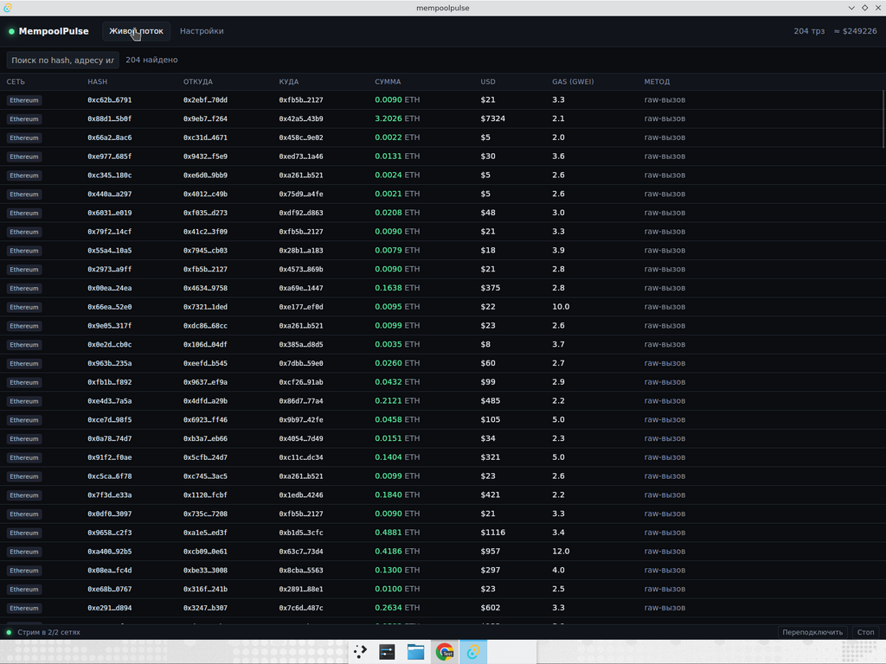
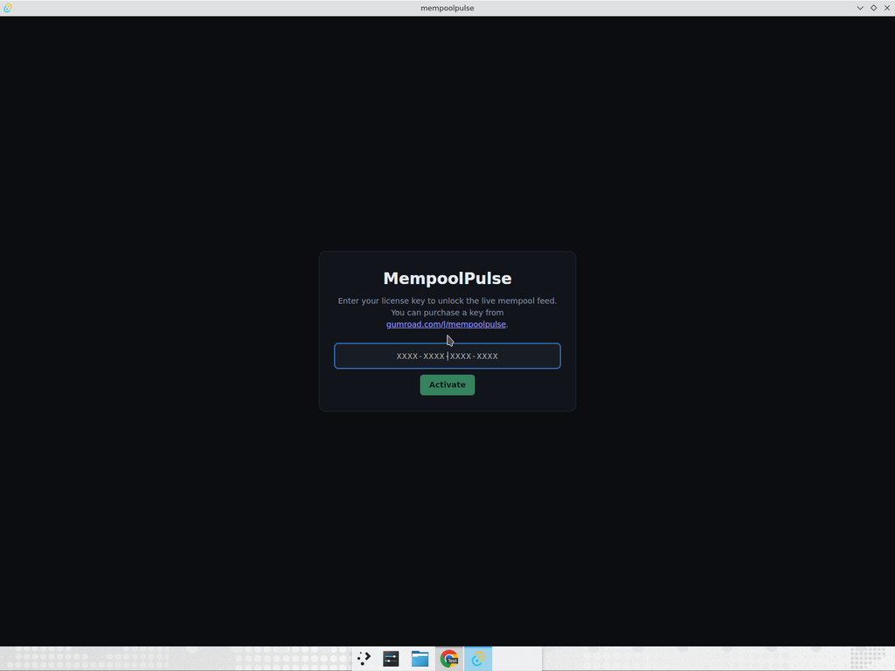

# MempoolPulse

> Real-time multi-chain mempool monitor for Ethereum, Arbitrum, Base, and BNB Chain. Native desktop app, BYO RPC, no subscription.

[](https://github.com/d71404189-beep/MempoolPulse/actions/workflows/build.yml)
[](https://github.com/d71404189-beep/MempoolPulse/releases/latest)
[](https://tauri.app)

MempoolPulse streams pending transactions directly from your own RPC providers, decodes the most common DEX swaps, NFT trades, lending operations and ERC20 calls, then surfaces the ones that matter — large transfers, watchlisted wallets, MEV-relevant swaps — in a clean live table with instant filtering.

It does **not** trade for you. It is a pure observation tool.



## Why use it

- **Multi-chain.** Ethereum, Arbitrum One, Base, BNB Chain — toggle each independently, watch them all in one window with per-chain pricing (ETH for L2s, BNB for BNB Chain).
- **Bring your own RPC.** Plug in any Alchemy / QuickNode / Infura WebSocket URL, or use the bundled free publicnode.com defaults. Your data never touches our servers because we don't run any.
- **Local-first.** Settings, watchlists and license keys live under your OS config dir. Nothing is uploaded.
- **Native and tiny.** Built with Tauri 2 + Rust. Installers are 2-3 MB; app idles at < 50 MB of RAM.
- **Decodes the noise away.** Out of every 1,000 pending txs you only care about a handful — DEX swaps, large transfers, calls to contracts on your watchlist. MempoolPulse classifies 50+ common selectors so you instantly see *what* is happening.
- **Russian + English UI** with auto-detection from your system locale.
- **One-time payment.** $49 forever, free updates within v1.x.

## Install

Pre-built installers for v1.0.0 are available from the [Releases page](https://github.com/d71404189-beep/MempoolPulse/releases/latest):

| Platform | File |
|----------|------|
| macOS Apple Silicon | `mempoolpulse_1.0.0_aarch64.dmg` |
| macOS Intel | `mempoolpulse_1.0.0_x64.dmg` |
| Windows (NSIS installer) | `mempoolpulse_1.0.0_x64-setup.exe` |
| Windows (MSI installer) | `mempoolpulse_1.0.0_x64_en-US.msi` |
| Linux (Debian / Ubuntu) | `mempoolpulse_1.0.0_amd64.deb` |
| Linux (other distros) | `mempoolpulse_1.0.0_amd64.AppImage` |

> v1.0 binaries are unsigned. On macOS, right-click → Open the first time. On Windows, click "More info" → "Run anyway" on the SmartScreen prompt. Code signing is on the v1.1 roadmap.

## Quick start

1. Launch MempoolPulse.
2. Activate with your license key (or any string in development).
3. The app boots with Ethereum enabled by default using free `publicnode.com` endpoints — you should see pending transactions within a few seconds.
4. To enable additional chains, open **Settings → Chains** and tick the boxes for Arbitrum, Base, or BNB Chain.

   

5. To filter the firehose, set thresholds and watchlist addresses under **Settings → Filters**.

   

For richer decoding on providers that only emit transaction hashes (QuickNode, Infura, publicnode), also paste the matching HTTPS URL into the chain card — MempoolPulse will fetch the tx body from there.

## What gets decoded

Out of the box, MempoolPulse recognises 50+ method selectors and labels them in the live feed, including:

- **DEX**: Uniswap V2/V3, Universal Router, PancakeSwap V2, 1inch v5, 0x v4, Curve, Balancer V2, CowSwap
- **NFT marketplaces**: OpenSea Seaport (5 variants), Blur
- **Lending / staking**: Aave V3, Lido, EigenLayer
- **Tokens**: ERC20 transfer/approve/transferFrom, ERC20 EIP-2612 permit, Permit2, ERC721/1155 transfers and `setApprovalForAll`, WETH/WBNB deposit/withdraw
- **Account abstraction & multisig**: Gnosis Safe execTransaction, ERC4337 EntryPoint handleOps
- **L2 bridges**: Arbitrum, Optimism/Base
- **Generic**: Multicall

Anything unrecognised falls through as `raw call` so you still see the value, gas, and addresses.

## Russian UI

`Settings → Language → Русский` switches the entire UI without restart.



## Activation

The app boots into a license gate on first run and verifies the entered key against the Gumroad licenses API:



In development builds (`cargo tauri dev` without `GUMROAD_PRODUCT_PERMALINK`), the license check accepts any non-empty key so contributors don't need a real product permalink.

## Building locally

```bash
# One-time deps (Linux):
sudo apt-get install libwebkit2gtk-4.1-dev librsvg2-dev libsoup-3.0-dev \
                     libssl-dev pkg-config build-essential libayatana-appindicator3-dev

npm install
npm run tauri dev
```

Bundle release artifacts:

```bash
GUMROAD_PRODUCT_PERMALINK=mempoolpulse npm run tauri build
```

CI builds for all 4 targets (macOS aarch64, macOS x64, Linux x64, Windows x64) on every tag matching `v*` — see [`.github/workflows/build.yml`](.github/workflows/build.yml).

## Repo layout

```
src/                 React + TypeScript frontend
src-tauri/src/
  decoder.rs         Selector lookup + lightweight ABI decoding
  mempool.rs         Per-chain WebSocket subscription workers
  prices.rs          Native asset / USD price fetcher (CoinGecko, cached per coin)
  license.rs         Gumroad license verification
  state.rs           Shared app state (chains, connections, txs)
  types.rs           Serializable types shared with the frontend
.github/workflows/   Cross-platform release builds
docs/screenshots/    UI screenshots used in the README and storefront
LANDING.md           Ready-to-paste Gumroad / Lemon Squeezy storefront copy
```

## Roadmap

- **v1.0** — Ethereum, Arbitrum, Base, BNB Chain (released)
- **v1.1** — Expanded decoder (50+ selectors: 1inch, Curve, Balancer, Seaport, Aave, NFTs, Permit2…), CSV/JSON export of the live feed (released)
- **v1.2** — Sound alerts on watchlist hits, custom alert rules
- **v1.3** — Code signing (macOS Developer ID, Windows EV) + auto-updater
- **v1.4** — Tx replay sandbox via local fork (anvil)
- **v1.5** — Solana support (Geyser-based pending stream)

## License

Proprietary. See [LICENSE](LICENSE).
